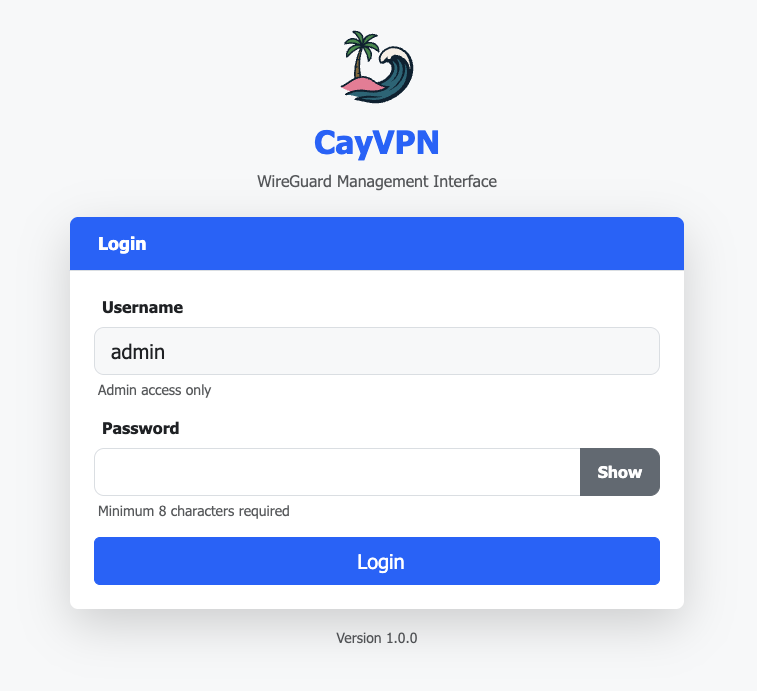
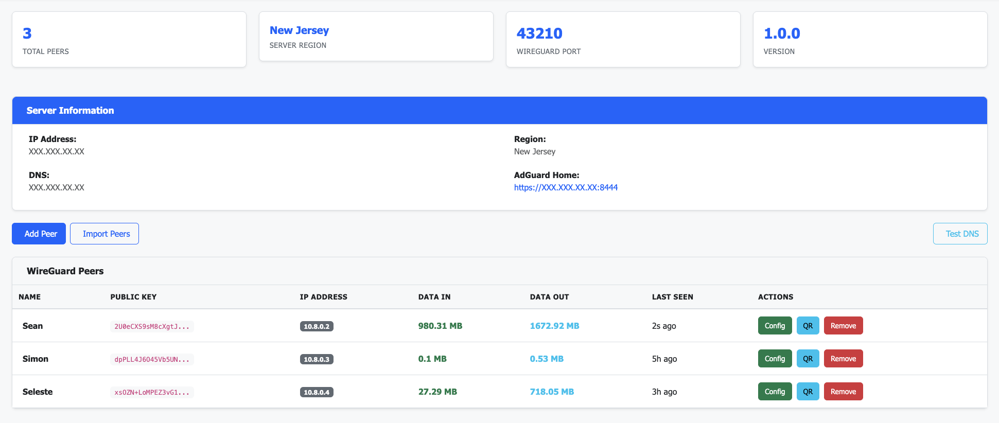
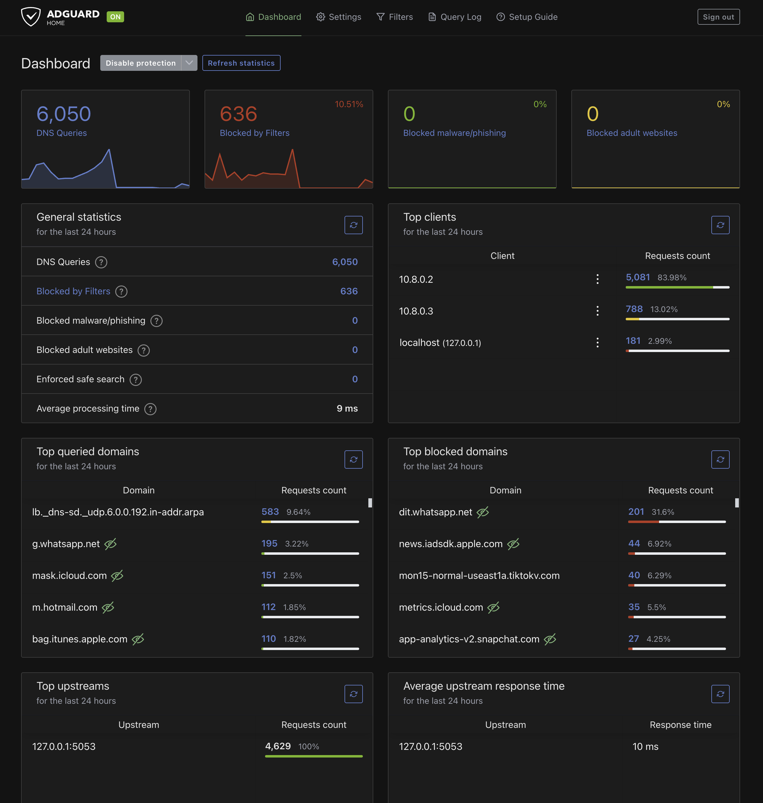

# CayVPN - Easy WireGuard VPN Management

A simple, secure VPN management system with WireGuard, DNS filtering, and a web interface. Get your VPN server running in minutes!

## 🚀 Quick Start

### Setting Up on DigitalOcean

1. **Create a DigitalOcean account**:
   - [Get $200 free credit for 2 months](https://m.do.co/c/eb6e30467a3e)

2. **Create a Droplet**:
   - Click **"Create"** → **"Droplets"**
   - **Choose Region**: Select the region where you want your VPN to be located (this will be your VPN's geographic location)
   - **Choose Image**: Select **Ubuntu 24.04 LTS**
   - **Choose Size**: Start with the basic plan (1GB RAM minimum recommended)
   - **Authentication**: Choose **SSH Key** (recommended) or **Password**
   - Click **"Create Droplet"**

3. **Connect to your Droplet**:
   
   **Option 1 - SSH from your terminal**:
   ```bash
   ssh root@your-droplet-ip
   ```
   (Replace `your-droplet-ip` with the IP address shown in DigitalOcean)
   
   **Option 2 - Use DigitalOcean Console**:
   Click on your Droplet → Click **"Console"** button in the top right to open a browser-based terminal

4. **Install CayVPN**:
   ```bash
   git clone https://github.com/caynetic/cayvpn.git
   cd cayvpn
   sudo ./install.sh
   ```

5. **Access your VPN dashboard**:
   - Open `https://your-server-ip:8443` in your browser
   - Accept the security warning (self-signed certificate)
   - Set your admin password

That's it! Your VPN server is ready.

## 🔧 Features

- ✅ WireGuard VPN with easy peer management
- ✅ QR codes for mobile device setup
- ✅ Real-time bandwidth monitoring
- ✅ Built-in DNS filtering (AdGuard Home)
- ✅ Secure web interface with HTTPS
- ✅ Automatic firewall setup

## 📊 Bandwidth & User Capacity

**Important: Plan your server resources carefully**

- **1TB monthly bandwidth comfortably supports up to 5 active users per month**
- This estimate is based on typical VPN usage including browsing, streaming, and general internet activity
- Heavy users (4K streaming, large downloads) will consume more bandwidth
- Light users (browsing, email) will consume less

**Scaling recommendations:**
- For more users, choose a plan with higher bandwidth allocation
- Monitor your bandwidth usage in your hosting provider's dashboard
- CayVPN's dashboard shows real-time data transfer per peer to help track usage

## �📸 Screenshots

### Login Page


### Dashboard - WireGuard Peers Management


### AdGuard Home - DNS Filtering Dashboard


## � Connecting Your Devices

After setting up your VPN server, you need to connect your devices as clients (peers).

### Adding a New Peer

1. Click the **"+ Add Peer"** button on the dashboard
2. Enter a name for your device (e.g., "iPhone", "Laptop", "Android")
3. The system will automatically generate a configuration

### For Mobile Devices (iOS/Android)

**Using QR Code (Easiest Method):**

1. Install the WireGuard app:
   - **iOS**: [Download from App Store](https://apps.apple.com/us/app/wireguard/id1441195209)
   - **Android**: [Download from Google Play](https://play.google.com/store/apps/details?id=com.wireguard.android)

2. Open the WireGuard app and tap the **"+"** button
3. Select **"Create from QR code"**
4. On your CayVPN dashboard, click the **"QR Code"** button next to your peer
5. Scan the QR code with your phone
6. Name the tunnel and toggle it **ON**

### For Desktop/Laptop (Windows, Mac, Linux)

**Using Configuration File:**

1. Install WireGuard:
   - **Windows**: [Download from wireguard.com](https://www.wireguard.com/install/)
   - **Mac**: `brew install wireguard-tools` or [download from App Store](https://apps.apple.com/us/app/wireguard/id1451685025)
   - **Linux**: `sudo apt install wireguard` (Ubuntu/Debian) or `sudo yum install wireguard-tools` (CentOS/RHEL)

2. On your CayVPN dashboard, click **"Download Config"** next to your peer
3. Save the `.conf` file to your computer

**Importing the Configuration:**

- **Windows/Mac**: Open WireGuard app → Click "Import tunnel(s) from file" → Select your `.conf` file
- **Linux**: 
  ```bash
  sudo cp your-config.conf /etc/wireguard/wg0.conf
  sudo wg-quick up wg0
  # To enable on startup:
  sudo systemctl enable wg-quick@wg0
  ```

### Activating the VPN

- **Mobile**: Toggle the switch next to your tunnel name
- **Desktop**: Click "Activate" in the WireGuard app
- **Linux**: `sudo wg-quick up wg0`

### Verifying Connection

Once connected, you should see:
- ✅ Active status in the WireGuard app
- ✅ Data transfer stats on your CayVPN dashboard
- ✅ "Last Seen" timestamp updates
- ✅ Your public IP changes to your VPN server's IP (check at [whatismyip.com](https://www.whatismyip.com))

### Managing Multiple Devices

You can add multiple peers for different devices. Each peer gets:
- Unique configuration
- Individual bandwidth tracking
- Separate QR code and config file
- Real-time connection monitoring

## �🛠️ Troubleshooting

If something doesn't work:
- **Reboot your server**: `sudo reboot`
- Check service status: `sudo systemctl status cayvpn`
- View logs: `sudo journalctl -u cayvpn -f`

For detailed help, see [DEPLOYMENT_CHECKLIST.md](DEPLOYMENT_CHECKLIST.md).

- Get paid support: Visit https://vpn.caynetic.com for $3 lifetime support

## 📄 License

This project is licensed under the MIT License - see the [LICENSE](LICENSE) file for details.

## 🤖 Development

This project was developed with the assistance of AI tools, but all code has been reviewed and verified by a professional software engineer.
