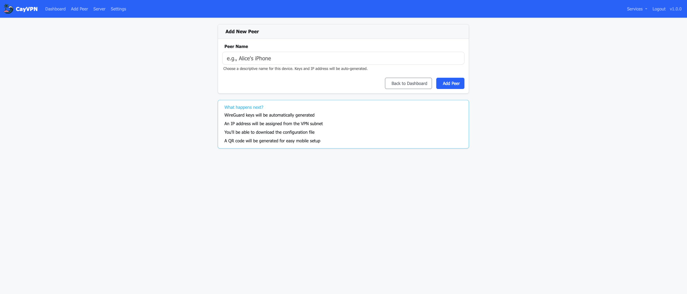

# CayVPN - Easy WireGuard VPN Management

A simple, secure, and modern VPN management system featuring WireGuard, AdGuard Home DNS filtering, and a beautiful web interface. Get your private VPN server running in minutes with HTTPS security, password hashing, CSRF protection, and real-time monitoring.

## Quick Start

### Setting Up on DigitalOcean

1. **Create a DigitalOcean account**:
   - [Get $200 free credit for 2 months](https://m.do.co/c/eb6e30467a3e)

2. **Create a Droplet**:
   - Click **"Create"** → **"Droplets"**
   - **Choose Region**: Select the region where you want your VPN to be located (this will be your VPN's geographic location)
   - **Choose Image**: Select **Ubuntu 24.04 LTS**
   - **Choose Size**: Start with the basic plan (1GB RAM minimum recommended)
   - **Authentication**: Choose **SSH Key** (recommended) or **Password**
   - Click **"Create Droplet"**

3. **Connect to your Droplet**:
   
   **Option 1 - Use DigitalOcean Console** (Easiest):
   Click on your Droplet → Click **"Console"** button in the top right to open a browser-based terminal
   
   **Option 2 - SSH from your terminal**:
   ```bash
   ssh root@your-droplet-ip
   ```
   (Replace `your-droplet-ip` with the IP address shown in DigitalOcean)

4. **Install CayVPN**:
   ```bash
   git clone https://github.com/caynetic/cayvpn.git
   cd cayvpn
   sudo ./install.sh
   ```

5. **Access your VPN dashboard**:
   - Open `https://your-server-ip:8443` in your browser
   - Accept the security warning (self-signed certificate)
   - Set your admin password on first login
   - Access AdGuard Home at `https://your-server-ip:8444` (uses same password)

That's it! Your VPN server is ready.

## Features

- ✅ **WireGuard VPN** - Fast, modern VPN protocol with easy peer management
- ✅ **Modern Web Dashboard** - Clean, mobile-responsive interface built with Bootstrap 5
- ✅ **QR Code Generation** - Instant mobile device setup
- ✅ **Real-time Monitoring** - Live bandwidth tracking and connection status
- ✅ **AdGuard Home Integration** - Built-in DNS filtering and ad-blocking (Port 3000/8444)
- ✅ **Secure HTTPS** - Self-signed SSL certificates with automatic generation
- ✅ **Password Security** - Bcrypt password hashing for both CayVPN and AdGuard
- ✅ **CSRF Protection** - Flask-WTF security against cross-site attacks
- ✅ **Rate Limiting** - Brute-force protection on login attempts
- ✅ **Session Management** - Secure server-side session storage
- ✅ **Automatic Firewall Setup** - iptables rules configured during installation
- ✅ **Easy Updates** - Pull latest changes from GitHub and restart

## Default Ports

- **CayVPN Web Interface (HTTPS)**: `8443`
- **CayVPN Web Interface (HTTP)**: `8888` (fallback if certificates missing)
- **AdGuard Home (HTTPS)**: `8444`
- **AdGuard Home (HTTP)**: `3000`
- **WireGuard VPN**: `43210/UDP`
- **DNS (AdGuard)**: `53/UDP` (internal VPN network only - 10.8.0.1)

## Security Features

- **HTTPS Encryption**: Self-signed SSL certificates auto-generated during installation
- **Password Hashing**: Bcrypt-based password storage (no plaintext passwords)
- **CSRF Protection**: Flask-WTF prevents cross-site request forgery attacks
- **Rate Limiting**: Login brute-force protection (5 attempts per minute)
- **Session Security**: Server-side session storage with 1-hour timeout
- **Secure Headers**: X-Frame-Options, CSP, X-Content-Type-Options, and more
- **Unified Authentication**: Single password for both CayVPN and AdGuard Home

## Network Configuration

- **VPN Network**: `10.8.0.0/24` (configurable)
- **Server IP**: `10.8.0.1`
- **Client IPs**: Auto-assigned starting from `10.8.0.2`
- **DNS Server**: `10.8.0.1` (AdGuard Home on VPN interface)
- **Allowed IPs**: `0.0.0.0/0, ::/0` (all traffic routed through VPN)
- **Persistent Keepalive**: 25 seconds (maintains connection through NAT)

## Bandwidth & User Capacity

**Important: Plan your server resources carefully**

- **1TB monthly bandwidth comfortably supports up to 5 active users per month**
- This estimate is based on typical VPN usage including browsing, streaming, and general internet activity
- Heavy users (4K streaming, large downloads) will consume more bandwidth
- Light users (browsing, email) will consume less

**Scaling recommendations:**
- For more users, choose a plan with higher bandwidth allocation
- Monitor your bandwidth usage in your hosting provider's dashboard
- CayVPN's dashboard shows real-time data transfer per peer to help track usage

## Screenshots

### Login Page


### Add Peer Interface



### Dashboard - WireGuard Peers Management


### AdGuard Home - DNS Filtering Dashboard


## Connecting Your Devices

After setting up your VPN server, you need to connect your devices as clients (peers).

### Adding a New Peer

1. Click the **"+ Add Peer"** button on the dashboard
2. Enter a name for your device (e.g., "iPhone", "Laptop", "Android")
3. The system will automatically generate a configuration

### For Mobile Devices (iOS/Android)

**Using QR Code (Easiest Method):**

1. Install the WireGuard app:
   - **iOS**: [Download from App Store](https://apps.apple.com/us/app/wireguard/id1441195209)
   - **Android**: [Download from Google Play](https://play.google.com/store/apps/details?id=com.wireguard.android)

2. Open the WireGuard app and tap the **"+"** button
3. Select **"Create from QR code"**
4. On your CayVPN dashboard, click the **"QR Code"** button next to your peer
5. Scan the QR code with your phone
6. Name the tunnel and toggle it **ON**

### For Desktop/Laptop (Windows, Mac, Linux)

**Using Configuration File:**

1. Install WireGuard:
   - **Windows**: [Download from wireguard.com](https://www.wireguard.com/install/)
   - **Mac**: `brew install wireguard-tools` or [download from App Store](https://apps.apple.com/us/app/wireguard/id1451685025)
   - **Linux**: `sudo apt install wireguard` (Ubuntu/Debian) or `sudo yum install wireguard-tools` (CentOS/RHEL)

2. On your CayVPN dashboard, click **"Download Config"** next to your peer
3. Save the `.conf` file to your computer

**Importing the Configuration:**

- **Windows/Mac**: Open WireGuard app → Click "Import tunnel(s) from file" → Select your `.conf` file
- **Linux**: 
  ```bash
  sudo cp your-config.conf /etc/wireguard/wg0.conf
  sudo wg-quick up wg0
  # To enable on startup:
  sudo systemctl enable wg-quick@wg0
  ```

### Activating the VPN

- **Mobile**: Toggle the switch next to your tunnel name
- **Desktop**: Click "Activate" in the WireGuard app
- **Linux**: `sudo wg-quick up wg0`

### Verifying Connection

Once connected, you should see:
- ✅ Active status in the WireGuard app
- ✅ Data transfer stats on your CayVPN dashboard
- ✅ "Last Seen" timestamp updates
- ✅ Your public IP changes to your VPN server's IP (check at [whatismyip.com](https://www.whatismyip.com))

### Managing Multiple Devices

You can add multiple peers for different devices. Each peer gets:
- Unique configuration
- Individual bandwidth tracking
- Separate QR code and config file
- Real-time connection monitoring

## Troubleshooting

### Common Issues

**Can't access the web interface:**

- Check if the service is running: `sudo systemctl status cayvpn`
- Check firewall rules: `sudo iptables -L -n -v`
- Verify ports are open: `sudo ss -tulpn | grep -E '8443|8444|43210'`
- View logs: `sudo journalctl -u cayvpn -f`

**VPN connection fails:**

- Verify WireGuard is running: `sudo systemctl status wg-quick@wg0`
- Check WireGuard interface: `sudo wg show`
- Ensure UDP port 43210 is open on your firewall/router
- Verify client config matches server (endpoint IP, port, keys)

**DNS not working:**

- Check AdGuard Home status: `sudo systemctl status AdGuardHome`
- Test DNS resolution: `dig @10.8.0.1 google.com`
- Verify AdGuard is listening: `sudo ss -tulpn | grep :53`
- Visit `/test_dns` in the CayVPN dashboard for diagnostics

**Internal Server Error on password setup:**

- Activate virtual environment: `source /root/cayvpn/venv/bin/activate`
- Install dependencies: `pip install -r requirements.txt`
- Check for bcrypt import errors in logs
- Restart service: `sudo systemctl restart cayvpn`

**General troubleshooting:**

- Reboot your server: `sudo reboot`
- Check service status: `sudo systemctl status cayvpn AdGuardHome wg-quick@wg0`
- View all logs: `sudo journalctl -u cayvpn -u AdGuardHome -u wg-quick@wg0 --since "10 minutes ago"`

For detailed help, see [DEPLOYMENT_CHECKLIST.md](DEPLOYMENT_CHECKLIST.md).

Get paid support: Visit <https://vpn.caynetic.com> for $3 lifetime support

## Updating CayVPN

To update your CayVPN installation to the latest version:

```bash
cd ~/cayvpn  # or wherever you installed CayVPN
git pull origin main
sudo systemctl restart cayvpn
```

**Important**: If you've made local changes to any files (like `install.sh`), you'll need to either:

- **Discard your local changes** (recommended for most users):

  ```bash
  git reset --hard HEAD
  git pull origin main
  sudo systemctl restart cayvpn
  ```

- **Or stash your changes** (if you want to keep them):

  ```bash
  git stash
  git pull origin main
  sudo systemctl restart cayvpn
  # To restore your changes later: git stash pop
  ```

After updating, verify the service is running:

```bash
sudo systemctl status cayvpn
```

## License

This project is licensed under the MIT License - see the [LICENSE](LICENSE) file for details.

## Development

This project was developed with the assistance of AI tools, but all code has been reviewed and verified by a professional software engineer.
